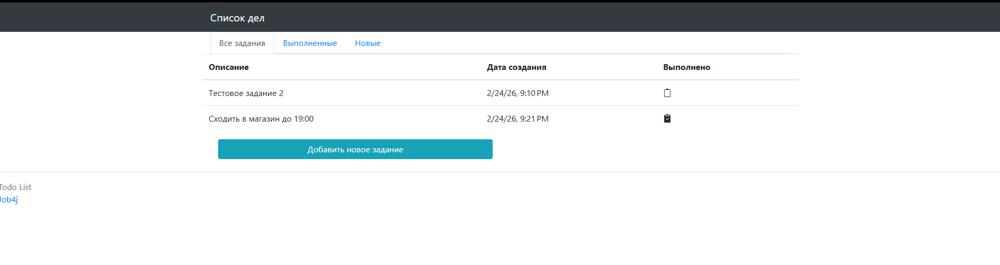
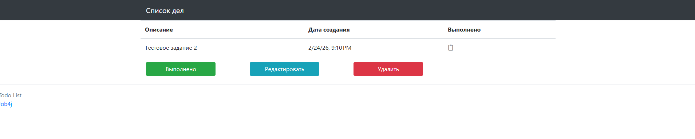

# TODO список

Данное приложение представляет из себя веб-приложение для управления заданиями.
В приложении есть возможность создания редактирования и удаления заданий.
Каждое задание имеет два состояния - выполнено и не выполнено.

### Стек технологий
>Spring boot<br>
>Thymeleaf<br>
>Bootstrap<br>
>Hibernate<br>
>PostgreSql<br>

### Требования к окружению
>java 21 <br>
>PostgreSQL 18 <br>
>Maven 3.9.11

### Сборка и запуск
Для запуска проекта используйте следующие команды в корневой директории:
```bash
  mvn package
  ```  
а затем:
```bash
  cd .\target
  java -jar job4j_todo-1.0-SNAPSHOT.jar
```

### Взаимодействие с приложением

Главная страница


Страница редактирования задания

